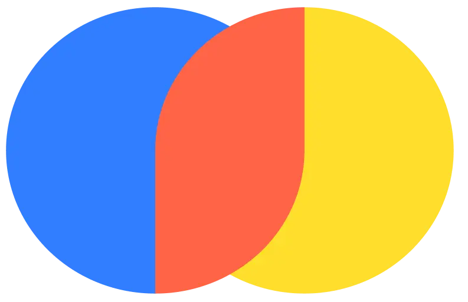

# Mastering LLMs: Training, Fine-Tuning, and Best Practices

A comprehensive full-day workshop covering the fundamentals and advanced concepts of Large Language Models (LLMs), from theoretical foundations to practical implementation and deployment strategies.

> [!Note]
> Visit [workshop website](https://raghavbali.github.io/mastering_llms_workshop/) to navigate with ease

## Workshop Details

📅 **Date:** August 23rd 2025  
🎟️ **Registration:** [Workshop Link](https://www.analyticsvidhya.com/datahacksummit-2025/workshops/mastering-llms-training-fine-tuning-and-best-practices-2)


## Modules

### [Module 01: Text Representation](docs/module_01_lm_fundamentals/README.md)
- Fundamentals of text representation
- Contextual embeddings using transformers.

### [Module 02: LLM Building Blocks](docs/module_02_llm_building_blocks/README.md)
- Internals of the transformer architecture: attention mechanism, embeddings, and core components that make up large language models
- HuggingFace pipelines for different tasks a language model can handle: classification, text generation, etc. 
- Fine-tune a pretrained GPT2 for code-generation.
- LLM Optimizations:
  - PEFT
  - Quantization/LoRA

### [Module 03: Instruction Tuning and Alignment](docs/module_03_instruction_tuning_and_alignment/README.md)
- Instruction Tuning
- LLM alignment or Performance Tuning using RLHF/PPO

### [Module 04: LLM Applications](docs/module_04_llm_apps/README.md)
- RAG
- LangChain
- DSpy
- Tool/Function Calling
- MCP

<details>
<summary>## Setup Instructions</summary>

### Prerequisites
Before attending the workshop, please ensure you have the following:

### Access/Services
- [Huggingface.co](https://huggingface.co/)
- [Github.com](https://github.com/)
- LLM API Keys:
  - OpenAI/Gemini/Claude OR
  - [Ollama](https://ollama.com/) for local LLMs

```bash
# Clone the repository
git clone https://github.com/raghavbali/mastering_llms_workshop_dhs2025.git
cd mastering_llms_workshop_dhs2025
```

### Environment Setup
- Notebooks are self-contained for quick setup
- Modules aimed at low-resource setups/colab compatible


</details>

<details>
<summary>## Prerequisites</summary>

- Familiarity with python, pytorch and python ecosystem
- Understanding of neural networks and deep learning concepts

</details>

## Previous Workshops

- **2024: [Unleashing LLMs: Training, Fine-Tuning and Evaluating](https://www.analyticsvidhya.com/datahacksummit-2024/workshops/unleashing-llms-training-finetuning-and-evaluating)**  
  - [Code/Github Repo](https://github.com/raghavbali/llm_workshop?tab=readme-ov-file)

- **2023: [Unleashing LLMs: Training, Fine-Tuning and Evaluating](https://www.analyticsvidhya.com/dhs-2023/workshop/natural-language-processing-using-generative-models/)**  
  - [Code/Github Repo](https://github.com/raghavbali/llm_workshop_dhs23)


## Thanks
A huge round of thanks to amazing teams at:
<div align="center" style="display: flex; justify-content: center; align-items: center; gap: 20px;">
  
  
  
  
  
  
</div>

## Citation

If you use materials from this workshop in your research or projects, please cite:

```bibtex
@misc{mastering_llms_workshop_2025,
  title={Mastering LLMs: Training, Fine-Tuning, and Best Practices},
  author={Raghav Bali},
  year={2025},
  url={https://github.com/raghavbali/mastering_llms_workshop_dhs2025},
  note={Workshop materials for DHS 2025}
}
```

## Contact

For questions about the workshop content or materials, please [open an issue](https://github.com/raghavbali/mastering_llms_workshop_dhs2025/issues) in this repository.

**Author:**
- 💼 **LinkedIn:** [www.linkedin.com/in/baliraghav](www.linkedin.com/in/baliraghav)
- 🌐 **Personal Website:** [https://raghavbali.github.io/](https://raghavbali.github.io/)
